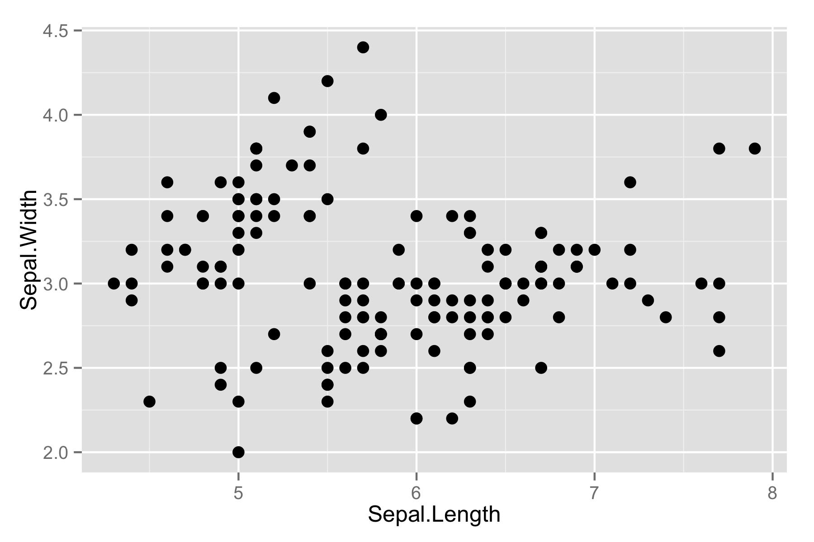
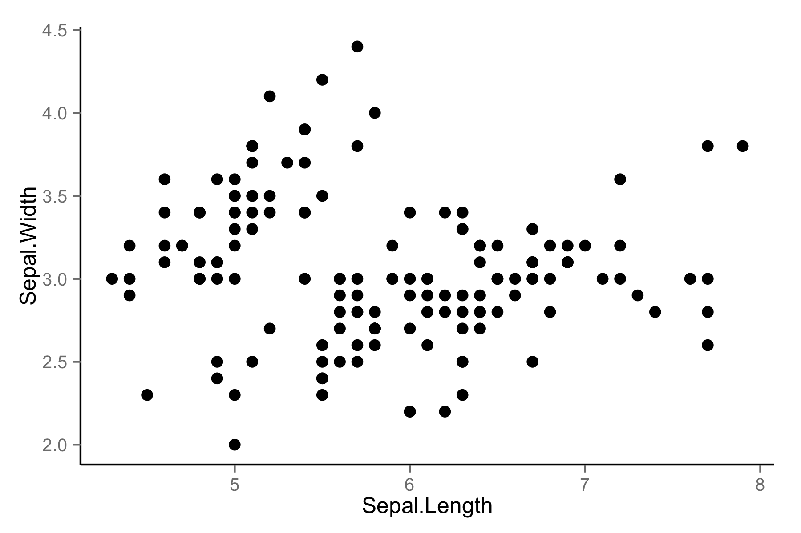

# Coyote

In an effort to keep my entire R environment reproducible, I'm moving everything from my `.rprofile` (except API keys) into a new package. 

Install this package in R using with: 

```coffee
install_github("coyote", "karthik")
```

## Notable functions

* `lsp()` - Lists all functions inside a package. Quick way to see what's been exported in a NAMESPACE. 

```coffee
lsp(ggplot2)
[1] "%+%"                       "%+replace%"               
  [3] "aes"                       "aes_all"                  
  [5] "aes_auto"                  "aes_string"               
  [7] "annotate"                  "annotation_custom"        
  [9] "annotation_logticks"       "annotation_map"           
 [11] "annotation_raster"         "autoplot"                 
 [13] "benchplot"                 "borders"                  
 [15] "calc_element"              "continuous_scale"         
 [17] "coord"                     "coord_cartesian"          
 [19] "coord_equal"               "coord_fixed"       
 ... [truncated]
```

You can also use the `pattern` argument to narrow down a function you might be looking for.

```coffee
> lsp(ggplot2, "scale")
 [1] "continuous_scale"          "discrete_scale"           
 [3] "scale_alpha"               "scale_alpha_continuous"   
 [5] "scale_alpha_discrete"      "scale_alpha_identity"     
 [7] "scale_alpha_manual"        "scale_area"               
 [9] "scale_color_brewer"        "scale_color_continuous"   
[11] "scale_color_discrete"      "scale_color_gradient"     
[13] "scale_color_gradient2"     "scale_color_gradientn"    
[15] "scale_color_grey"          "scale_color_hue"          
[17] "scale_color_identity"      "scale_color_manual"       
[19] "scale_colour_brewer"       "scale_colour_continuous"  
[21] "scale_colour_discrete"     "scale_colour_gradient"    
[23] "scale_colour_gradient2"    "scale_colour_gradientn"  
...[truncated]
```

## Shortcuts

* `len` short for `length`
* `h` short for `head`
* `n` short for `names`
* `s` short for `summary`


## Default `ggplot` themes

I prefer a minimalist theme for my ggplots. The `onLoad()` function inside the package automatically loads `ggplot2`, and set this theme.

So a default plot that looks like:



will look like:



## Miscellanea

Package also loads (inside `onLoad()`) libraries that I use all the time like `knitr`, `devtools`, `ggplot2`.

__Additional notes__
All these functions are meant to help with development. None of these are ever used in production. I also run everything with `R --vanilla` before shipping code to someone else.


